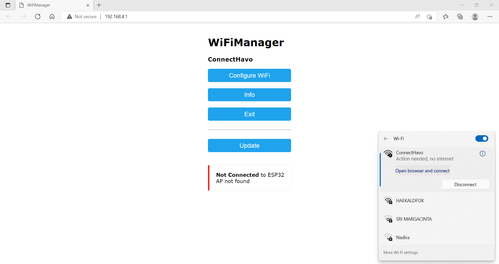
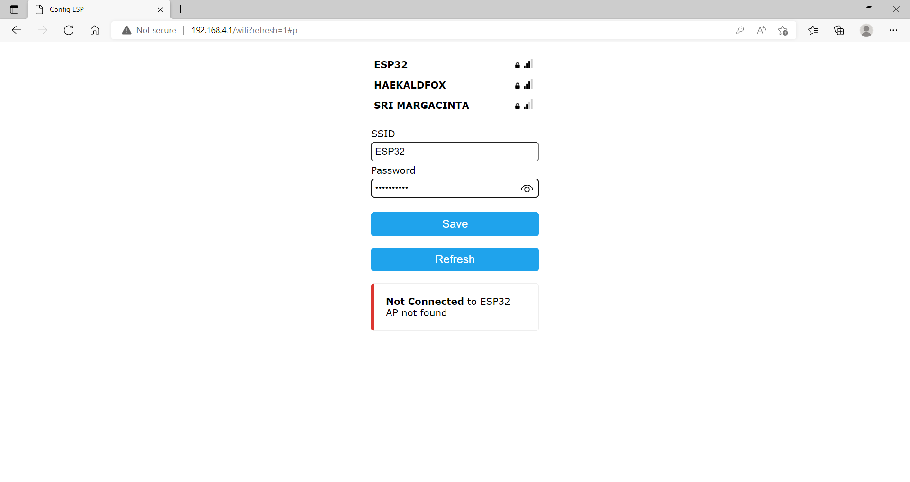
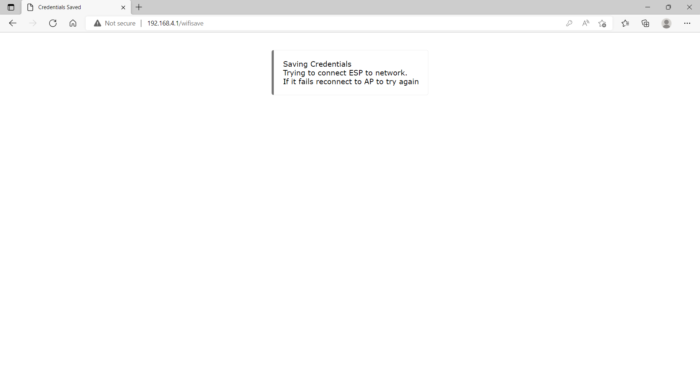
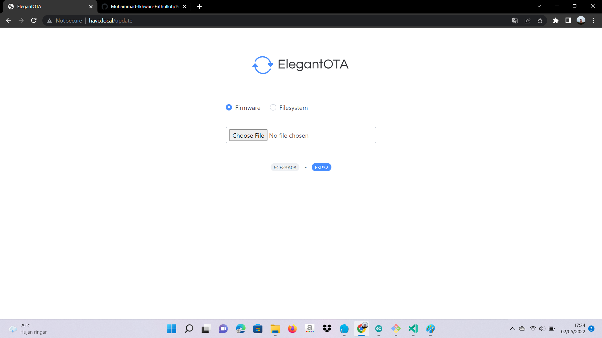
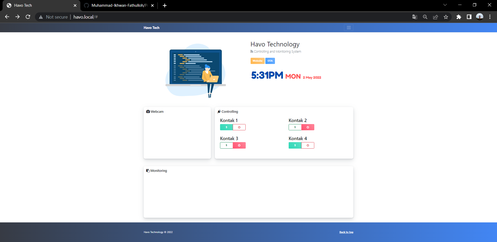
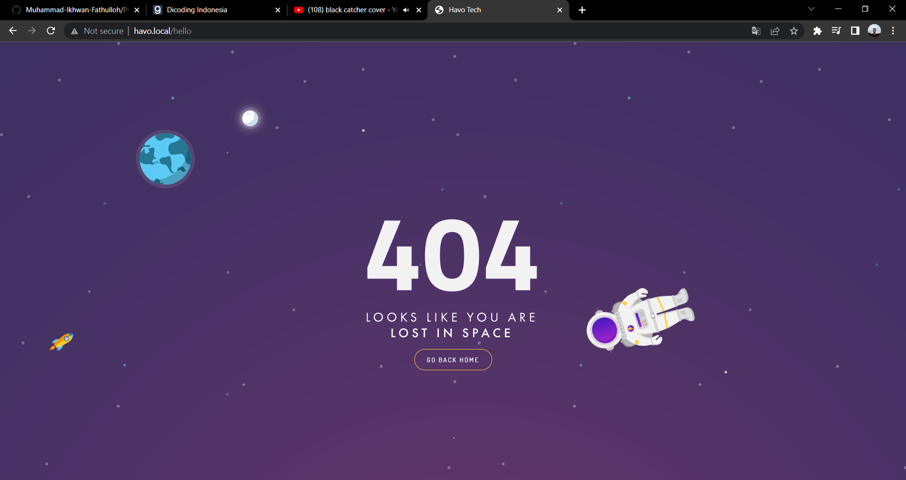

# Project-Dashboard-Internet-of-Things
Stack : HTML, CSS, Javascript, C++, Bootstrap 5, Websocket, ESP8266/32, JSON, Arduino

### Libraries System
<ul>
    <li>ESP8266/32</li>
    <li>ESPmDNS</li>
    <li>WebSocketServer</li>
    <li>ArduinoJSON</li>
    <li>AsyncElegantOTA</li>
    <li>ESPAsyncWebServer</li>
    <li>WifiManager</li>
</ul>

### Wifi Manager

### System View On The Air (Update Dynamic Code with Wifi)

### System View Ver 1

### Page Not Found

