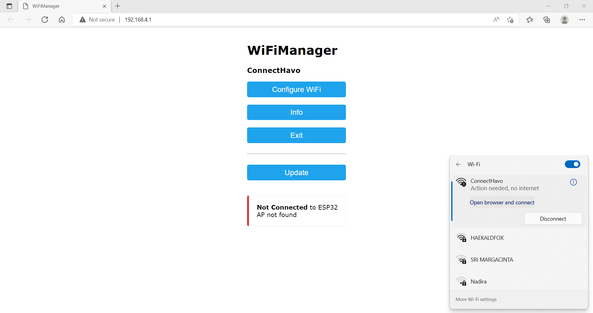
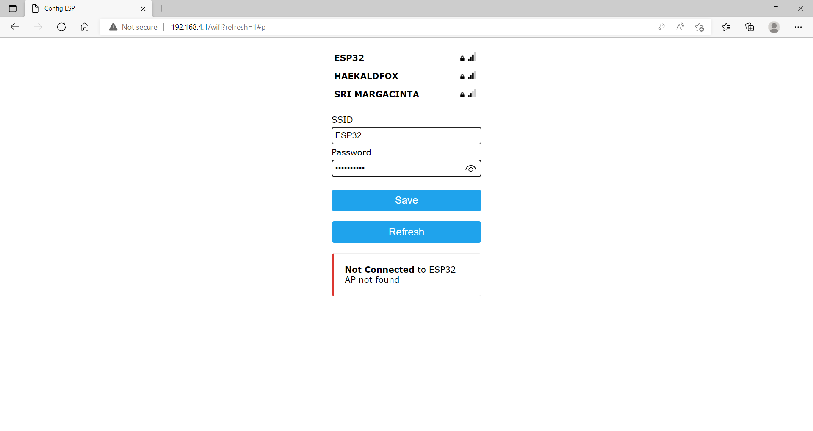
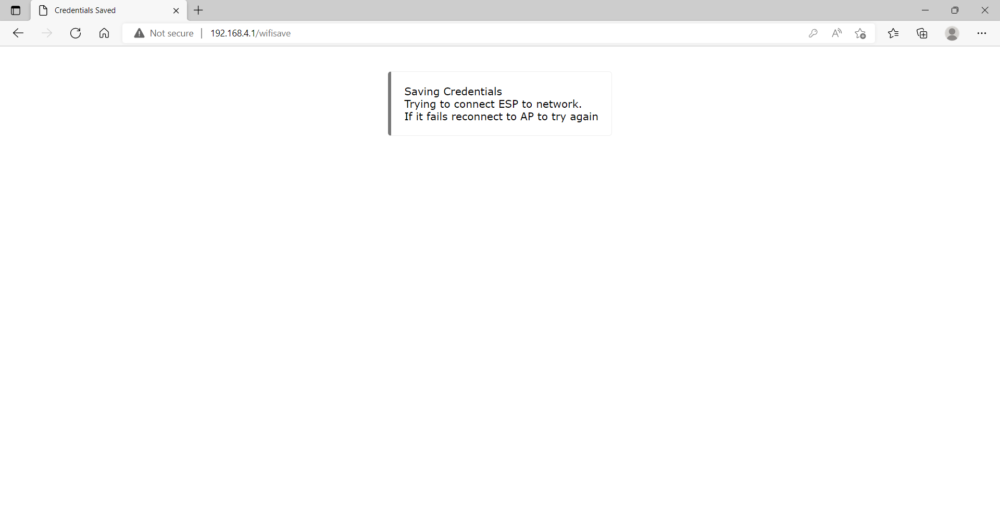
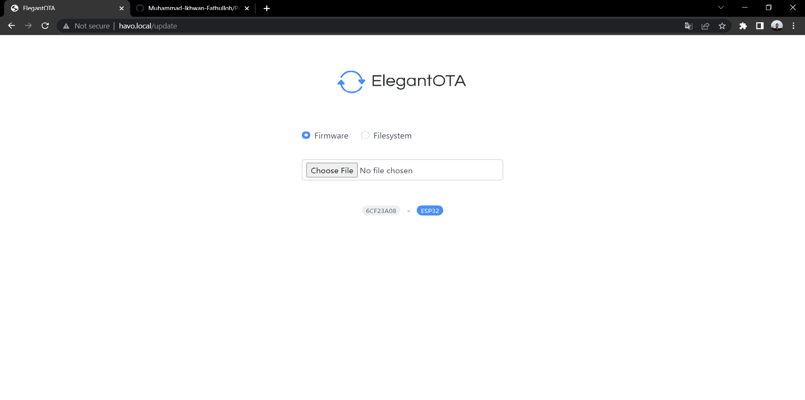
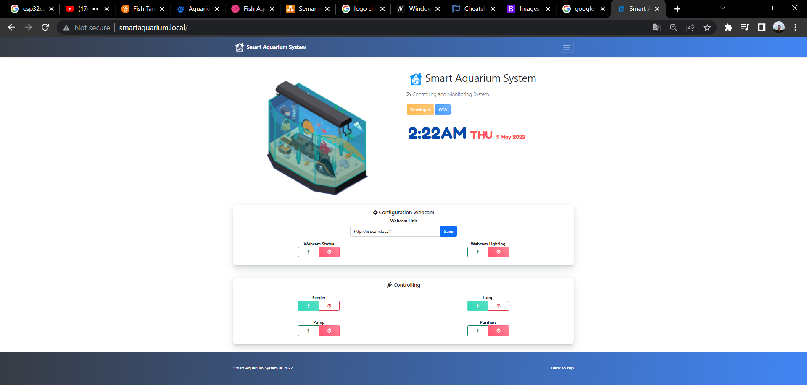
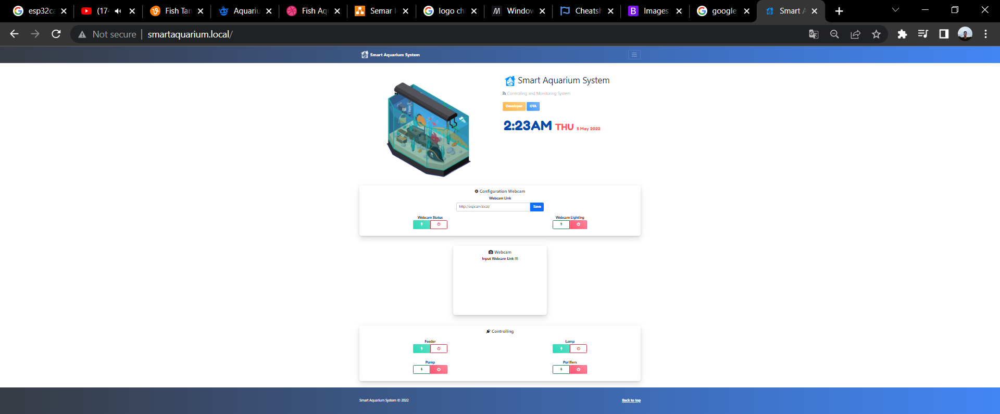
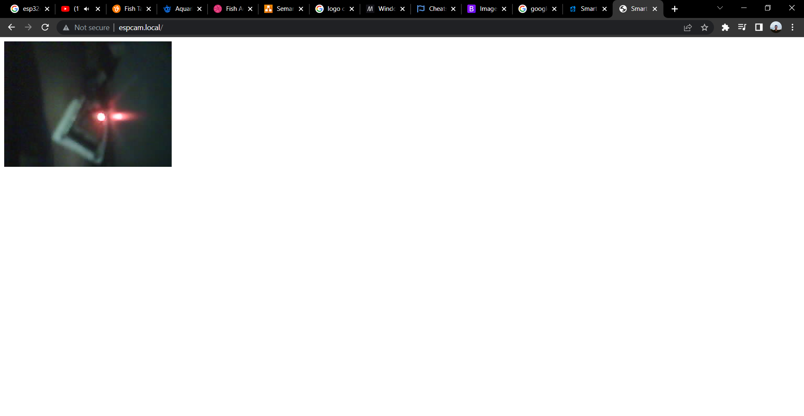
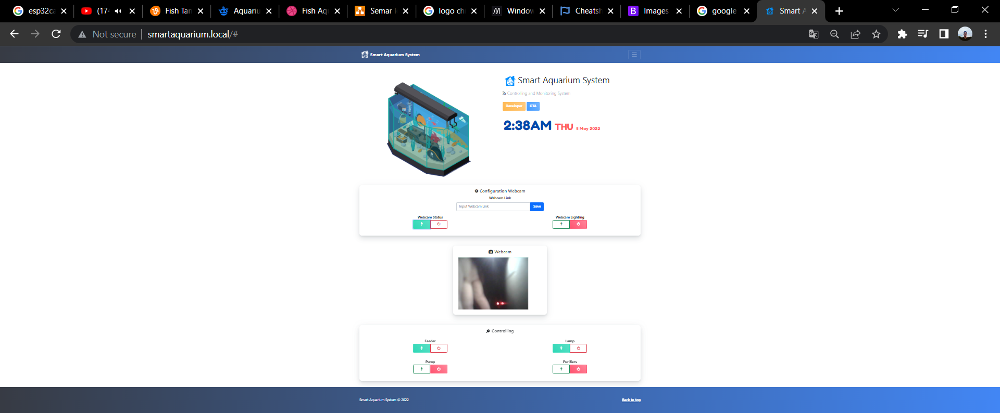
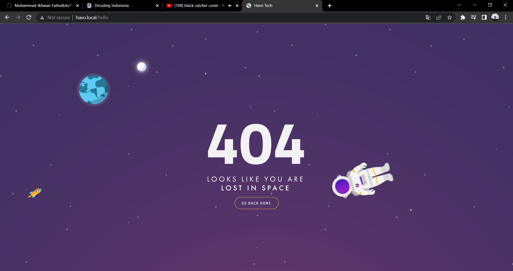

# Project Smart Aquarium System based on Internet of Things
<h1><strong>Smart Aquarium System</strong></h1>

Stack : HTML, CSS, Javascript, C++, Bootstrap 5, Websocket, ESP8266/32, JSON, Arduino

Description Project Internship <a href="https://www.havo.co.id/">Havo Smart Technology</a> : Smart Aquarium System is an aquarium monitoring system using a live streaming camera, and can control systems such as automatic feeding, lighting, pumps, and water purifiers with a website-based Internet of Things.

### Libraries System
<strong>Module Dashboard Smart Aquarium</strong>
<ul>
    <li>ESP8266/32</li>
    <li>ESPmDNS</li>
    <li>WebSocketServer</li>
    <li>ArduinoJSON</li>
    <li>AsyncElegantOTA</li>
    <li>ESPAsyncWebServer</li>
    <li>WifiManager</li>
    <li>Ticker</li>
</ul>

<strong>Module Camera Smart Aquarium</strong>
<ul>
    <li>ESP32Cam</li>
    <li>ESPmDNS</li>
    <li>WebSocketServer</li>
    <li>WifiServer</li>
    <li>WifiManager</li>
</ul>

### Wifi Manager

### System View On The Air (Update Dynamic Code with Wifi)
<strong>Url : http://smartaquarium.local/update</strong>

### Dashboard Smart Aquarium System
<strong>Url : http://smartaquarium.local/</strong>

<strong>Url : http://espcam.local/</strong>

Webcam with Module <a href="https://github.com/Muhammad-Ikhwan-Fathulloh/ESP32Cam">Project ESP32Cam</a>, add url project espcam in dashboard master

<strong>Fetch url espcam in smartaquarium</strong>

### Page Not Found
<strong>Url : http://smartaquarium.local/notfound</strong>

